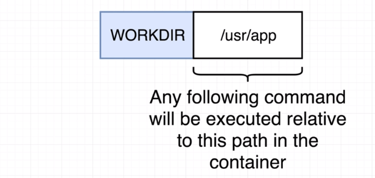
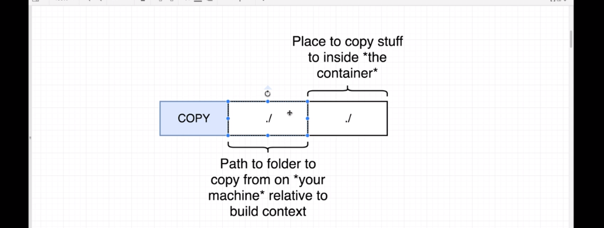
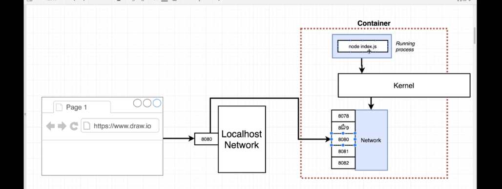
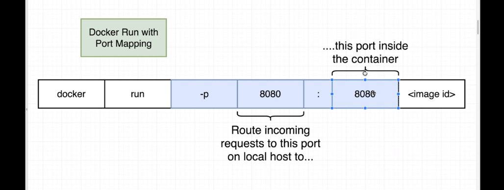

### Real Projects with docker

#### Nodejs web app

1. `FROM node:alpine` (versions or tags are specified after colon) 
   Specify base image that contains node and npm preinstalled  
   (with additional programs we might need for nodejs app).  
2. `WORKDIR /usr/app` 
   It will **create** that directory if it does not exist. 
   Also, it **prevents** adding our files and folders inside **root** directory where it can conflict with other files and folders that already exists inside root. It's basically our working directory where our project would exist. Also, if later we want to execute commands inside container using `docker exec`, we will be able to do that inside working directory automatically. 
     
3. `COPY ./ ./`  
   Copy files to container (it's own isolated hard drive segment). 
   It will **COPY** files inside working directory we have specified above.
     
      
4. `RUN npm install` 
   Install dependencies  
5. `CMD ["npm", "start"]` 
   **start** is a script inside package.json file that executes `node index.js`  

6. `docker build -t <docker-id>/<image-name> .` 
   So, image has been created with name/tag.  
7. `docker run -p 8080:8080 <image-id>`  
   Port mapping: forwarding of requests from outside of container to inside container 
   It is **NOT** specified in dockerfile as it's a runtime thing.
     
   
     
   
     
