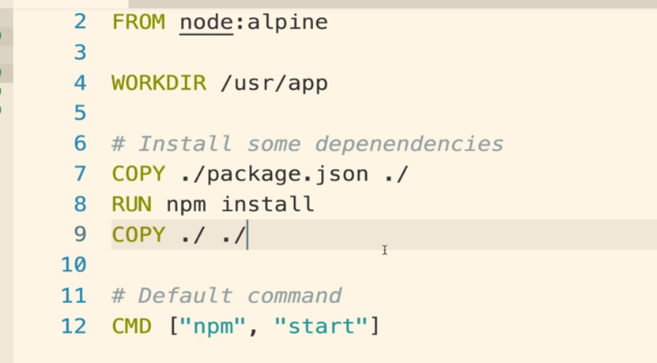

### Unnecessary Rebuilds

1. In previous project, if we change code in one of the source files, we would need to rebuild the docker image again to make sure it realise that a file has been chaned. But it will also cause all commands that are written after it including `npm install` to execute again. This is unnecessary and it wastes so much of time as for big projects these commands take a lot of time.
2. One way to overcome this issue is by reducing build time. We can change the order of commands inside docker file so that it takes less time to rebuild again. For ex:   
     
