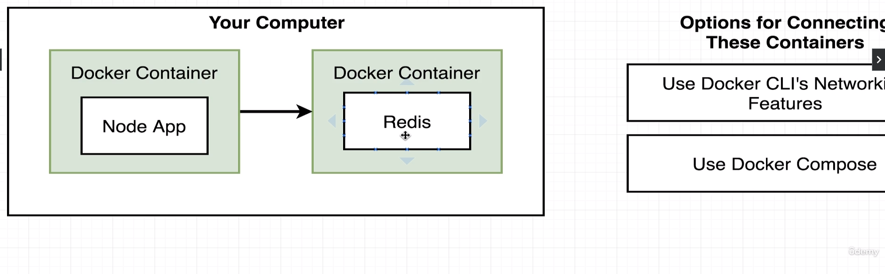
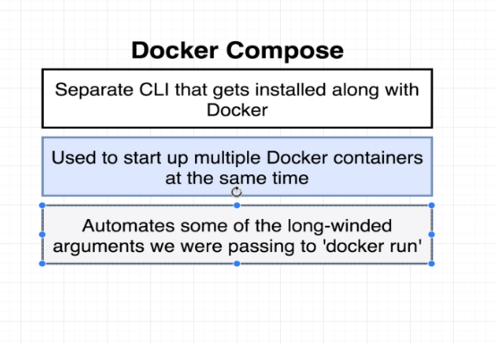
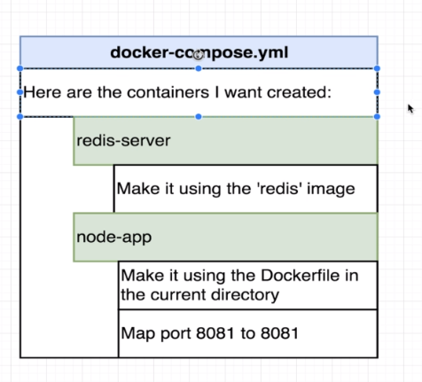
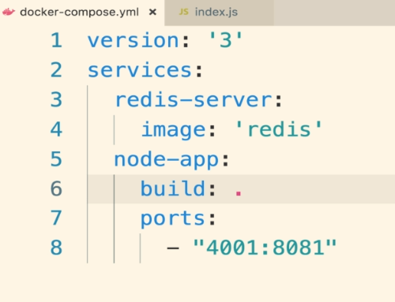
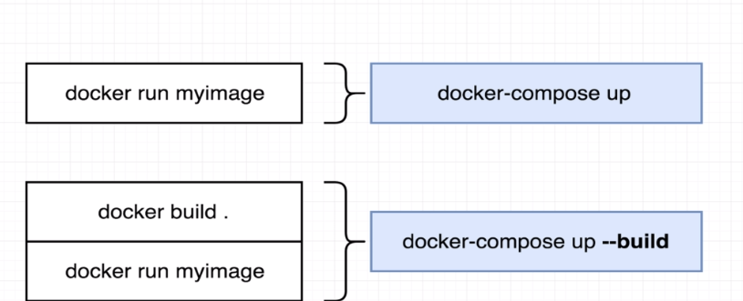
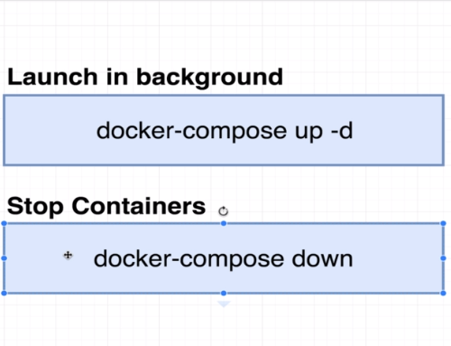
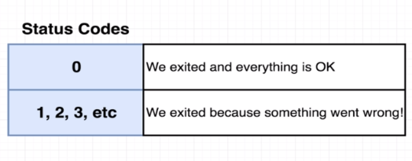
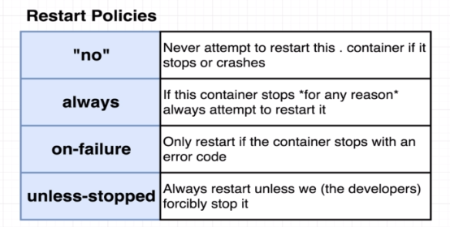

### Docker compose with multiple local containers

1. By default, if we have multiple containers running on your machine, they don't communicate with each other and completely run in isolation. We have to set up some kind of networking infrastructure to make them communicate with each other. We can implement it in 2 ways: docker-cli (very cumbersome) and docker compose.  
     
2. Docker compose   
   It is used to run multiple containers at once in a **SAME** network. Docker compose automatically creates a networking layer where all the services or containers can communicate with each other freely. We don't need any kind of port mapping between the services seperately.  
   NOTE: Also, container-name can be used instead of url to connect with each other as docker automatically routes the request by looking at container-name.
     
     
     

     

3. Docker compose commands   
   `docker-compose ps` : get status of all containers created with docker-compose file  
     
     

4. Maintaining containers and automatically restarting containers  
   Docker uses restart policies to decide whether to restart containers when it stops. The default restart policy is **"no"** (apply quotes)  
   Also, a process has exit codes. Any non-zero code means there was an error. Remember a container is also a process. So when it stops, it means the container process has exited  
     
     
