### commands

1. We can also provide alternate startup command (to execute inside container) after it starts up. <br>
   `docker run <image-name> <command>` <br>
   For example when we run -> `docker run busybox ls` <br><br>
   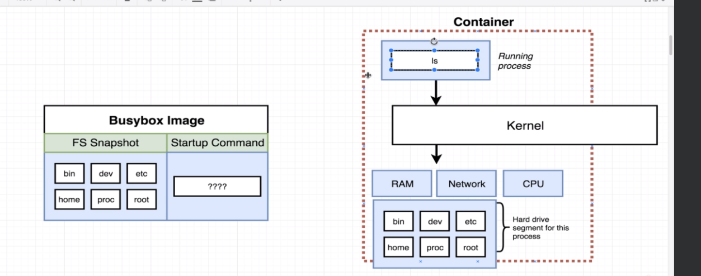

2. But in below hello-world example, we cannot execute 'echo' or 'ls' commands because the executables or processes that these commands run behind the scenes does not exist in filesystem.<br><br>
   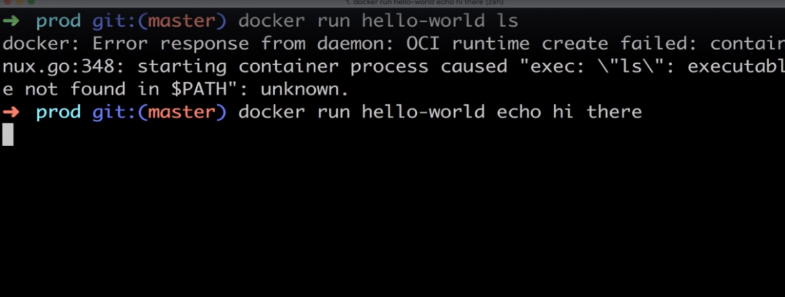

3. `docker ps` : list all runnning containers.
4. `docker ps --all` : list all containers ever created (includes exited ones).
5. `docker run <image-name>` <br><br>
   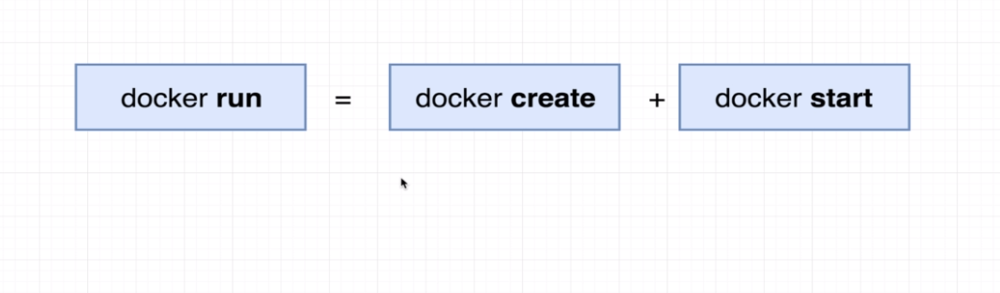 <br><br>
   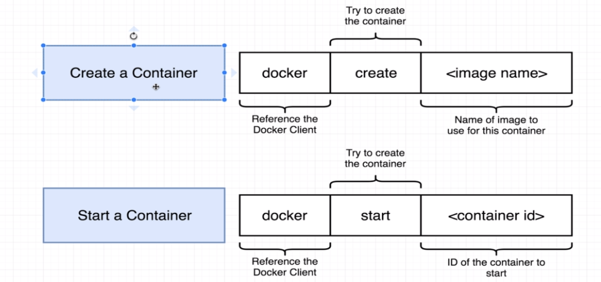 <br><br>
   Creating is about getting file system ready without actually starting container and starting is about actually executing startup commands. <br>
   `docker run` =  
   `docker create hello-world` + `docker start -a <container-id>`
   <br>
   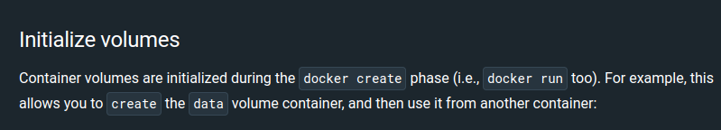 <br><br>
   Docker's run command by default shows all the logs coming out of container but start command is just the opposite. Adding **-a** watches for any output from container and prints it to console.

6. `docker system prune`<br>
   to remove stopped containers and reclaim space.<br><br>
   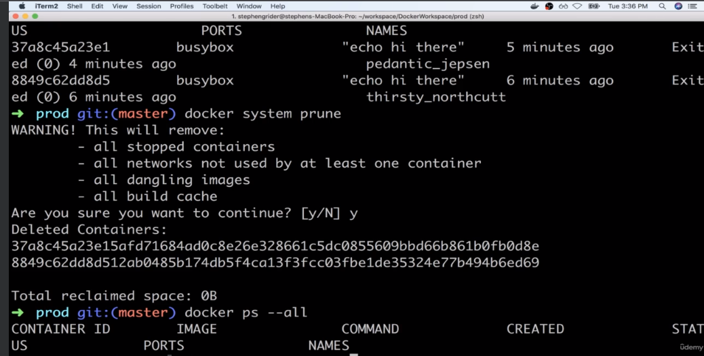

7. `docker logs <container-id>` <br>
   to see output logs from a stopped container<br><br>
   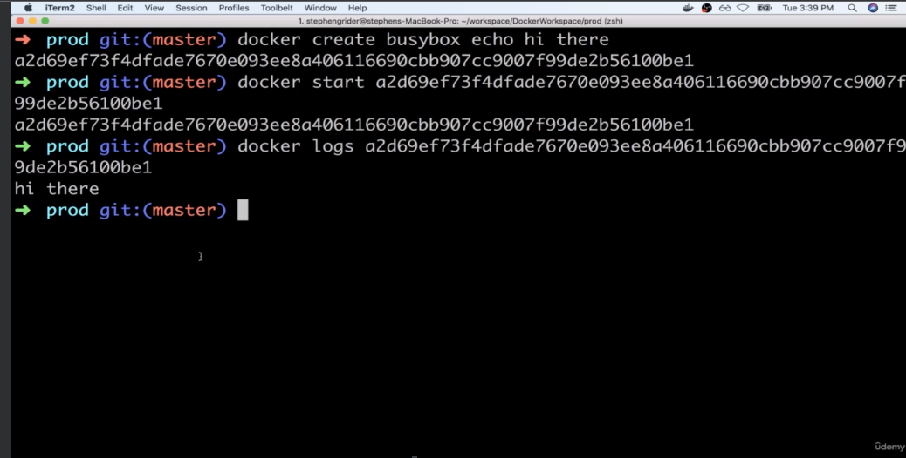

8. **stop** command gives some time to process to clean up and then shut down unlike **kill** command.<br><br>
   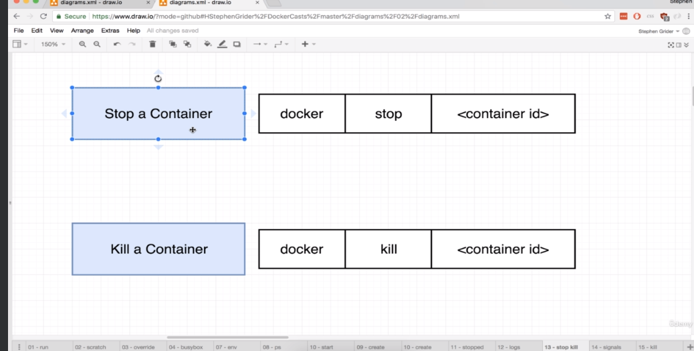

9. Execute multiple commands inside container <br><br>
   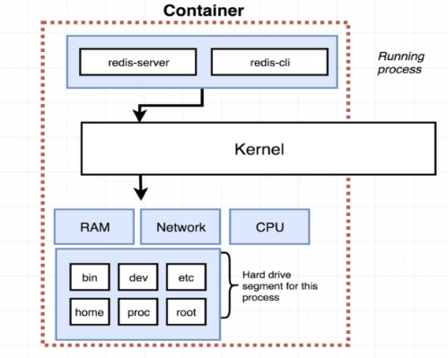
   <br>
   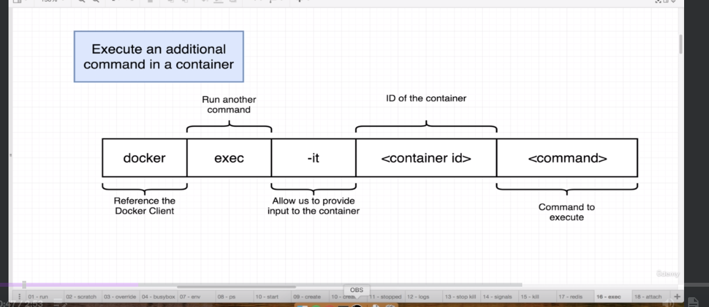

   ### Purpose of -it flag

   It's a combination of -i and -t flags<br>
   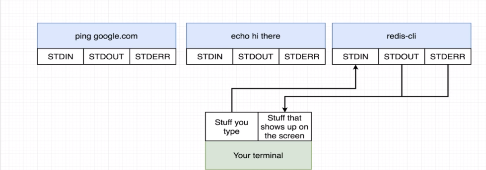<br>
   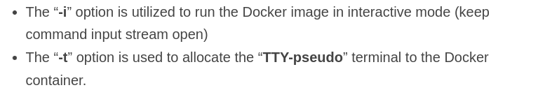

10. To get access to a shell/terminal to execute commands in the container <br>
just like window powershell or linux bash, use: <br>
```docker exec -it <container-id> sh```
<br><br>
We can also use  ```docker run -it <image-id> sh```  to run shell (default <br>
startup command) when starting container. But most often we will have other <br>
primary process to run while starting container.<br>
In this way we can execute multiple commands at once interactively instead of
<br>using ```docker exec``` command again and again.
<br>
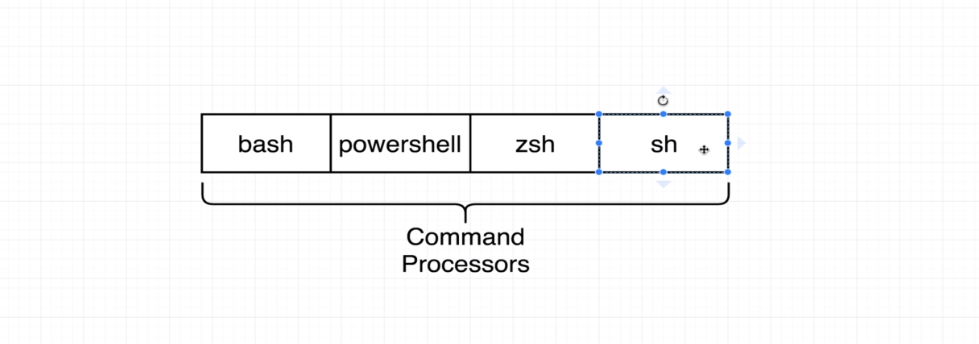