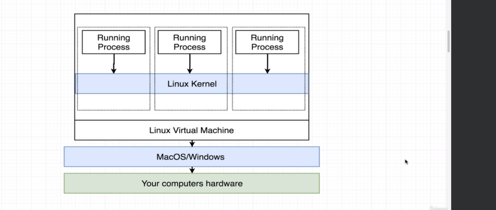

### Note:

When docker cli is issued a command to run image, it first checks image locally and then reaches out to docker hub and then downloads in image cache for future use.

### Container

1. A program with it's own isolated set of hardware resources.
2. Namespacing and control groups concept is used in Linux OS specifically to isolate resources per process / group of processes.
3. Namespacing and control groups put together is what a container is actually.
4. Image is sum of file system snapshot plus startup commands. File system snapshot tells what directories and files are there. Startup commands tells us how and what processes to run after container is created.
5. When we install a docker, we also install a linux virtual machine that actually does the job of creating and managing containers.  
   
6. When container finishes executing all processes or commands, it automatically shuts down.
7. Suppose container has been started with alternative startup command and it has exited. Then we cannot restart it with another startup command
8. Just a reminder: Even if the 2 containers are created with same image,  
they will __NOT__ share the same file system. By default they will always run  
in isolation.