### Creating custom images

NOTE: [Docker image build process in detail](https://www.udemy.com/course/docker-and-kubernetes-the-complete-guide/learn/lecture/11436706#overview)
 
 At each stage, the docker image obtained from previous step is taken, a  container is run from this image, that particular command / instruction is  executed, which makes a change in file system. We take this container's  file system snapshot and create another image from it and pass it as input  to next instruction. This whole process is repeated until we reach the end.  The last CMD instruction just tells docker to set it up as startup command  for final created image.

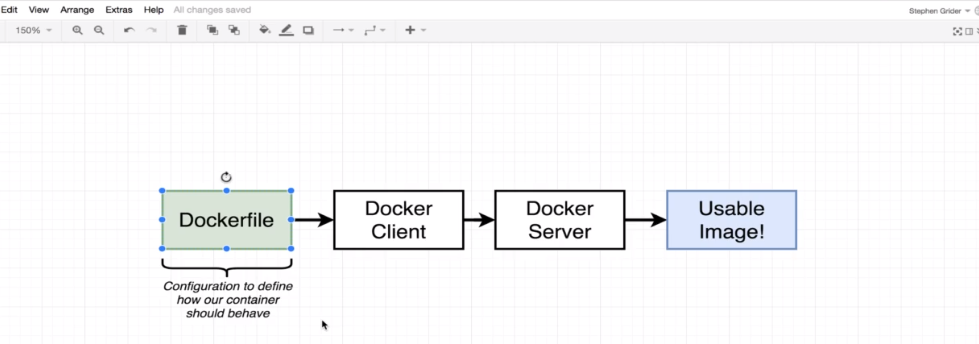 
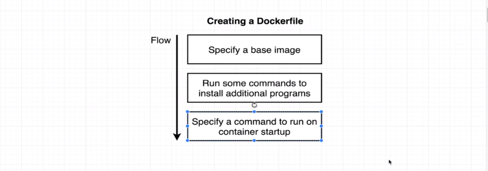 
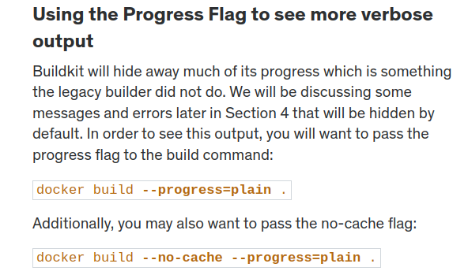 
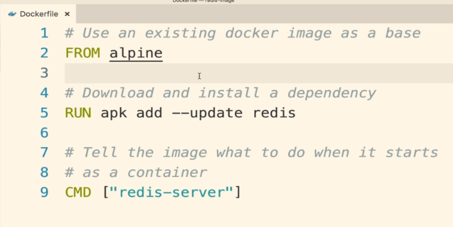 
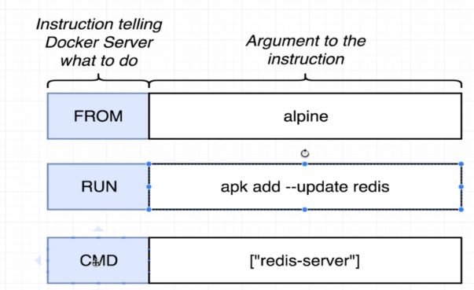  

Build process:
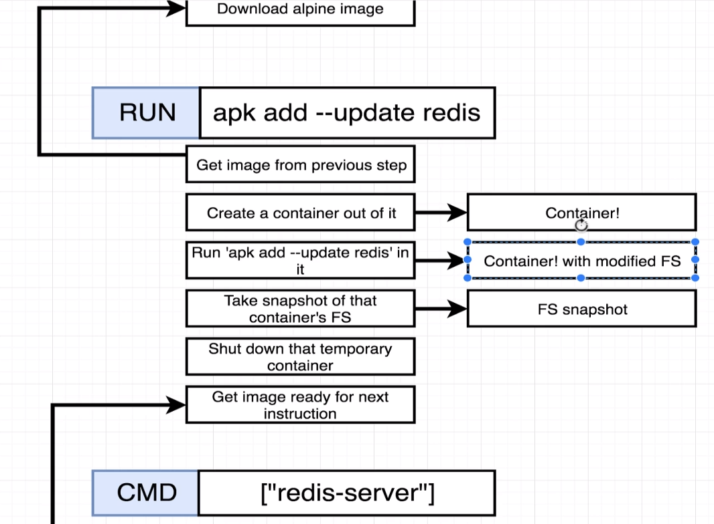 
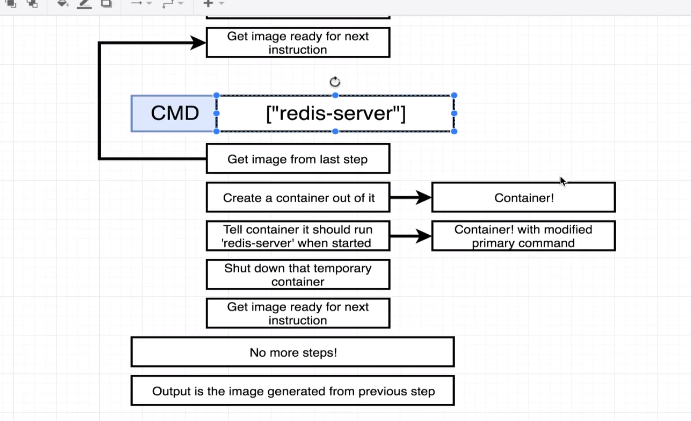  

### Docker image build command 

1. checkout to directory where Dockerfile exists.
2. `docker build .` 
   **.** indicates build context (specifies the directory of files/folders to use for the build) 

3. [Build Process in detail](https://www.udemy.com/course/docker-and-kubernetes-the-complete-guide/learn/lecture/11436706#overview)

Analogy of Dockerfile instructions
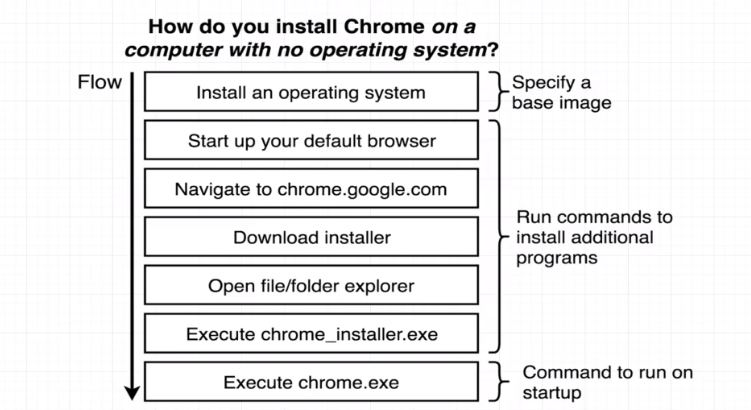 
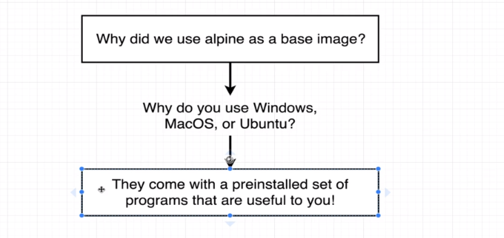  

Tagging image
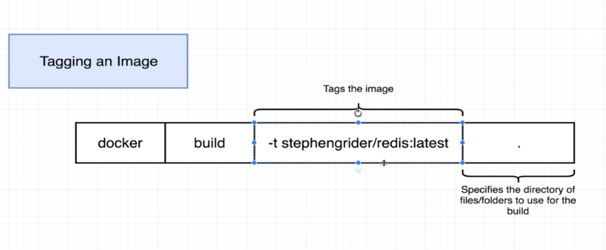 
(docker-id/custom-name:version)  

Manual docker image generation from container (just as in build process)

1. [manual image generation](https://www.udemy.com/course/docker-and-kubernetes-the-complete-guide/learn/lecture/11436722#overview)
2. 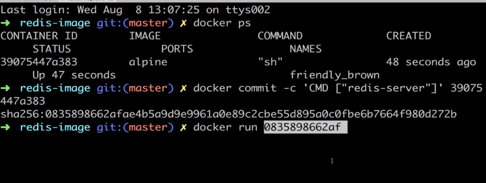
